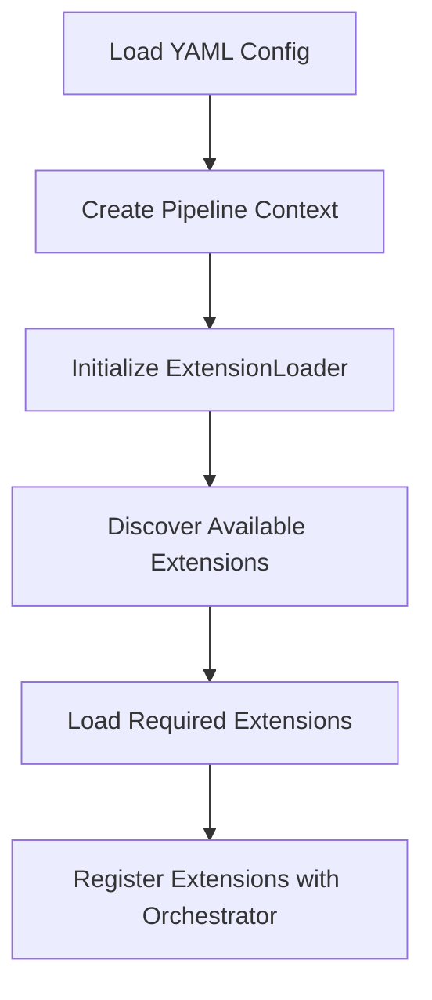
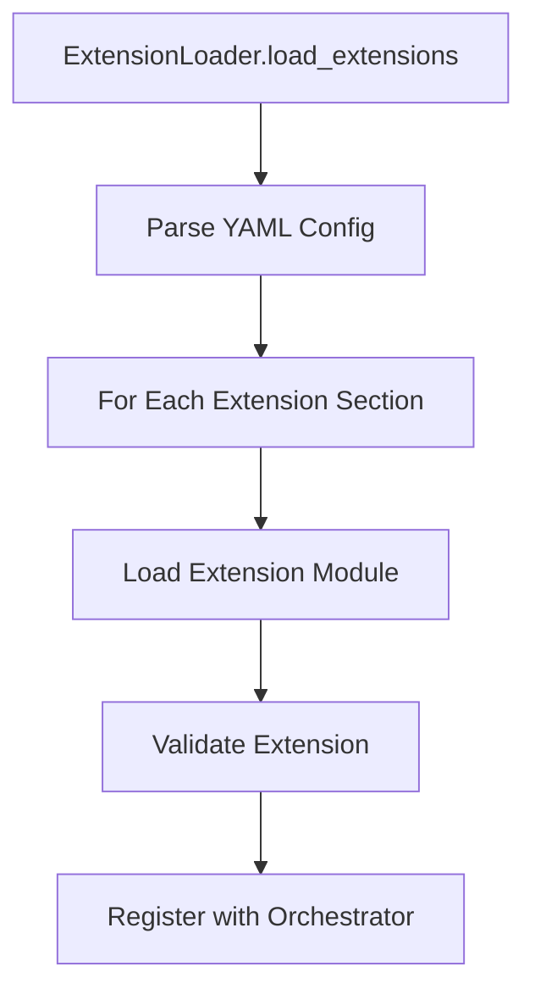
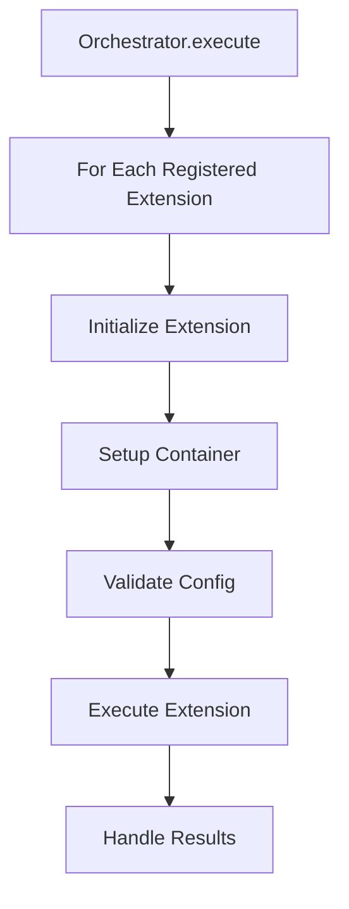

# Dagger Pipeline Architecture

## Core Design Principles

### 1. Separation of Concerns
- Each component has a single, well-defined responsibility
- Clear boundaries between pipeline core and extensions
- Extensions operate in isolation from each other
- Core orchestrator manages global state and coordination

### 2. Information Isolation
- Extensions only receive configuration they need
- No access to global pipeline state from extensions
- Core pipeline configuration stays within orchestrator
- Extension state is self-contained

### 3. Resource Isolation
- Each extension manages its own resources
- Container environments are isolated
- State management is extension-specific
- Cleanup handled at appropriate scope

## Core Components Overview

### 1. Pipeline Configuration (`dagger_example.yaml`)
- Defines the complete pipeline structure
- Specifies which extensions to load and their configurations
- Contains core execution defaults and settings
- Defines relationships between extensions
- Maintains strict separation between global and extension-specific config

### 2. Extension System

#### Extension Loader (`src/core/loader.py`)
- Dynamically discovers and loads extension modules
- Validates extension compatibility
- Manages extension dependencies
- Provides extension registry functionality
- Ensures isolation between extensions

```python
ExtensionLoader
├── discover_extensions()    # Find available extensions
├── load_extension()        # Load single extension
├── load_extensions()       # Load multiple extensions
└── validate_extension()    # Validate extension compatibility
```

#### Extension Handler (`src/handlers/extension.py`)
- Base interface for all extensions
- Defines standard lifecycle methods
- Manages container operations
- Handles extension-specific validation
- Maintains isolated state and resources

```python
ExtensionHandler
├── initialize()           # Setup extension instance
├── setup_container()      # Prepare container environment
├── validate()            # Validate configuration
└── execute()             # Run extension logic
```

### 3. Orchestration Layer (`src/core/orchestrator.py`)
- Manages pipelines execution flow
- Handles extensions registration and lifecycle
- Coordinates between extensions
- Maintains pipelines state
- Controls information flow between components

```python
Orchestrator
├── register_extension()   # Add extension to pipeline
├── initialize()          # Setup pipeline
├── execute()             # Run pipeline
└── cleanup()             # Cleanup resources
```

## Component Responsibilities

### 1. Core Pipeline
Responsibilities:
- Loading and validating complete configuration
- Managing global pipeline state
- Coordinating extension execution
- Handling pipeline-wide resources

Access Level:
- Full access to all configuration
- Manages global state
- Controls extension lifecycle
- Coordinates between extensions

### 2. Orchestrator
Responsibilities:
- Extensions registration and initialization
- Configuration distribution
- Execution flow management
- Resource coordination

Access Level:
- Full access to pipeline configuration
- Manages extension registry
- Controls execution context
- Handles cross-extension coordination

### 3. Extensions
Responsibilities:
- Implementing specific functionality
- Managing own container environment
- Handling extension-specific state
- Self-contained cleanup

Access Level:
- Only receives own configuration
- No access to other extensions
- No access to pipeline internals
- Limited to own resource scope

## Execution Flow

### 1. Pipeline Initialization


### 2. Extension Loading Process


### 3. Extension Execution Flow


## Configuration Hierarchy

### 1. Pipeline Level (Orchestrator Only)
```yaml
core:
  execution_defaults:
    max_attempts: 3
global_vars:
  environment: prod
extensions:
  example:
    - name: example-1
      ...
  terraform:
    - name: terraform-dev
      ...
```

### 2. Extension Level (What Extensions See)
```yaml
name: example-1
location: ./example
message: "Hello World"
commands:
  - command: "echo Starting example"
execution_settings:
  timeout_seconds: 300
```

## Implementation Guidelines

### 1. Extension Loading
```python
# Example flow in main.py
loader = ExtensionLoader()
extensions = loader.load_extensions(config.extensions)
orchestrator.register_extensions(extensions)
```

### 2. Extension Registration
- Extensions must be registered before initialization
- Registration validates extension compatibility
- Establishes extension order and dependencies
- Maintains isolation between extensions

### 3. Extension Initialization
- Occurs after registration
- Sets up extension-specific resources
- Prepares container environment
- Validates configuration
- Ensures resource isolation

### 4. Extension Execution
- Follows defined order in pipeline
- Handles dependencies between extensions
- Manages state between extensions
- Provides error handling and retry logic
- Maintains execution isolation

## State Management

### 1. Pipeline State
- Tracks overall pipeline progress
- Maintains extension status
- Handles cross-extension data
- Controlled by orchestrator only

### 2. Extension State
- Manages extension-specific data
- Tracks container state
- Handles extension results
- Isolated from other extensions

## Error Handling

### 1. Pipeline Level
- Manages overall pipeline failures
- Coordinates recovery strategies
- Handles cleanup on failure
- Maintains error isolation

### 2. Extension Level
- Handles extension-specific errors
- Implements retry logic
- Manages resource cleanup
- Contains error scope

## Security Considerations

### 1. Access Control
- Extensions have minimal required access
- No access to pipeline internals
- Controlled resource permissions
- Isolated execution environments

### 2. Configuration Security
- Sensitive data only where needed
- No sharing of credentials
- Isolated secrets management
- Least privilege principle

### 3. Resource Security
- Container isolation
- Resource access controls
- Clean resource cleanup
- No cross-extension access

## Extension Interface

### 1. Provided to Extensions
```python
def __init__(self, 
    name: str,                         # Extension instance name
    config: Dict[str, Any],            # Extension-specific config only
    client: dagger.Client,             # Dagger client for containers
    execution_defaults: ExecutionDefaults  # Execution settings
)
```

### 2. Not Provided to Extensions
- Pipeline configuration
- Other extension details
- Global pipeline state
- Cross-extension data

## Future Considerations

### 1. Extension Marketplace
- Standard format for extensions
- Version management
- Dependency resolution
- Isolation guarantees

### 2. Pipeline Templates
- Reusable pipeline configurations
- Best practice templates
- Industry-specific workflows
- Configuration isolation patterns

### 3. Monitoring and Metrics
- Pipeline performance tracking
- Extension metrics
- Resource usage monitoring
- Isolation verification
